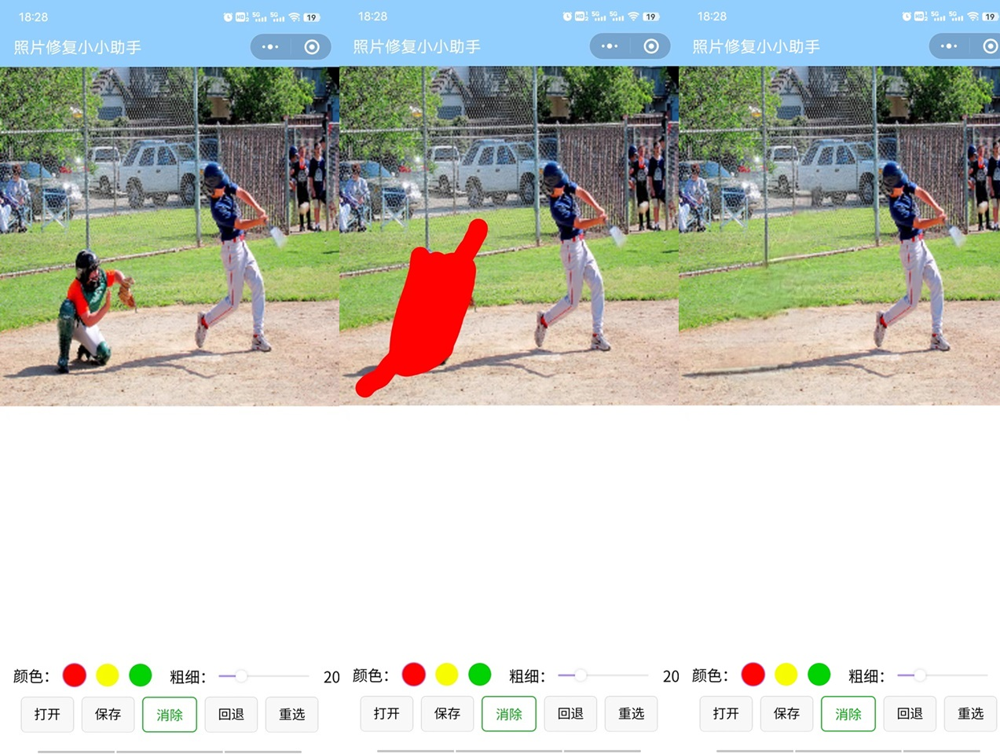

# Inpaint_wechat(照片修复小小助手)
Inpaint_wechat is a WeChat mini-program based on the WeChat AI capabilities, implementing the functionality of inpainting and repairing selected areas in images,  which is purely implemented by the client and has no server.

The program draws inspiration from the logic and some code of the original MI-GAN project and inpaint_web project.

Given the limited support for operators in WeChat mini-programs, to address this constraint, the program utilizes WebAssembly (wasm) technology. 
Additionally, it integrates with WeChat-adapted OpenCV techniques to achieve model preprocessing and post-processing. 

Inpaint_wechat是一款基于微信AI能力的微信小程序，实现了图片选定区域的消除修复功能，纯客户端实现，无服务端。

本程序借鉴了 MI-GAN 原项目和 inpaint_web 网页实现项目的逻辑以及部分代码。

鉴于微信小程序仅支持有限的算子，为了弥补这一限制，本程序采用了 WebAssembly (wasm) 技术，并结合适配微信的 OpenCV 技术，以实现对模型的预处理和后处理。
## Video Demo（视频演示）
<video src='media/inpaint-wechat_480.mp4' width=240> </video>
## Demo(1.选择图片  2.选择区域  3.消除)

## QR Code for the Wechat App （扫描微信小程序二维码打开小程序）

## Contact

[📺 bilibili](https://space.bilibili.com/2031846058)

## Reference

- The MI-GAN model

https://github.com/Picsart-AI-Research/MI-GAN

- The inpaint-web repository

https://github.com/lxfater/inpaint-web

- Adapted opencv for WeChat

https://github.com/sanyuered/WeChat-MiniProgram-AR-WASM
