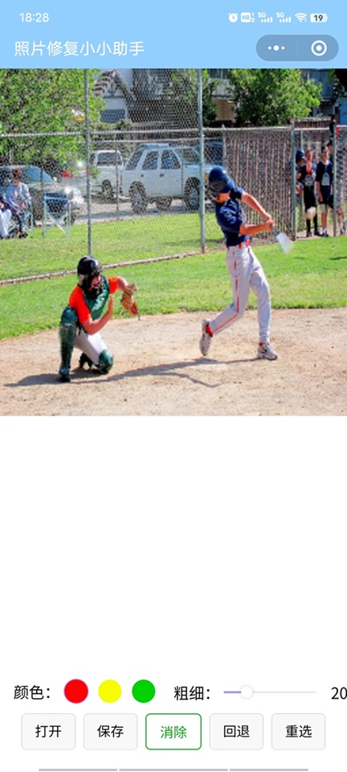
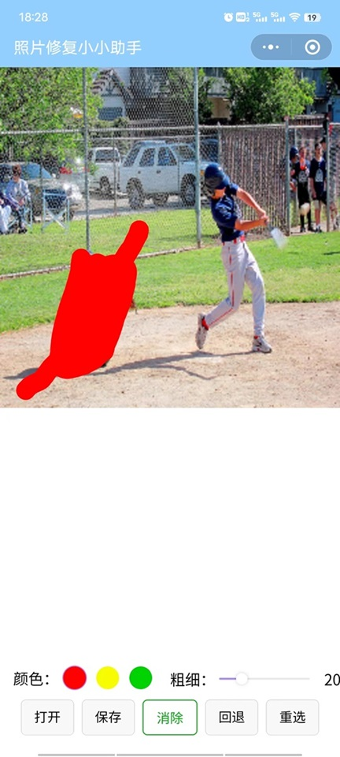
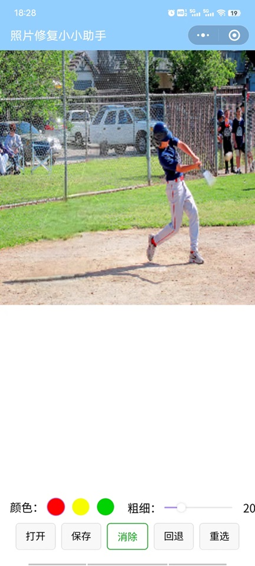

# Inpaint_wechat
Inpaint_wechat is a WeChat mini-program based on the MI-GAN model, implementing the functionality of eliminating and repairing selected areas in images. 

This program draws inspiration from the logic and some code of the MI-GAN project and inpaint_web project.

Given the limited support for operators in WeChat mini-programs, to address this constraint, the program utilizes WebAssembly (wasm) technology. 
Additionally, it integrates with WeChat-adapted OpenCV techniques to achieve model preprocessing and post-processing. 

Inpaint_wechat是一款基于 MI-GAN 模型的微信小程序，实现了图片选定区域的消除修复功能。

该程序借鉴了 MI-GAN 项目和 inpaint_web 项目的逻辑以及部分代码。

鉴于微信小程序仅支持有限的算子，为了弥补这一限制，本程序采用了 WebAssembly (wasm) 技术，并结合适配微信的 OpenCV 技术，以实现对模型的预处理和后处理。

## Demo

## QR Code for the Wechat App （微信小程序二维码）

## Contact

## Reference

- The MI-GAN model

https://github.com/Picsart-AI-Research/MI-GAN

- The inpaint-web repository

https://github.com/lxfater/inpaint-web

- Adapted opencv for WeChat

https://github.com/sanyuered/WeChat-MiniProgram-AR-WASM
